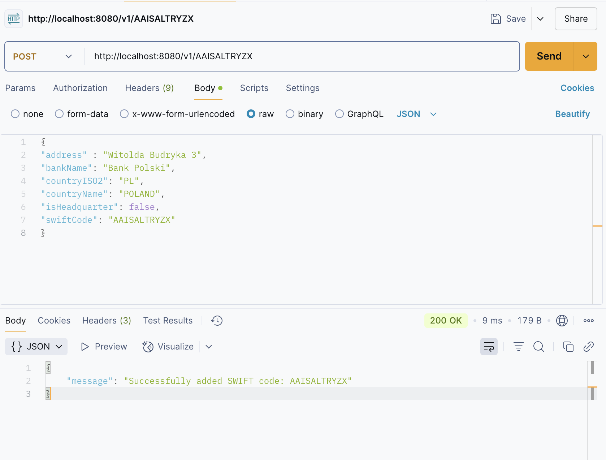
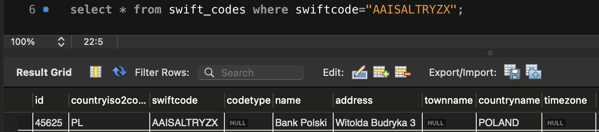

# Remitly_HeesungKim

## Environment for programming

Database: MYSQL 8.0.35\
Language : go 1.22.5 darwin/amd64\
Endpoint API framework: Postman\
Container : Docker (Docker-compose)

## Fundamental

- `go run .` useful command to compile and run program, but not build to binary file.
- `go build` complile the packages,
- After `go build` and run with `./<filename>`

## Parsing

-

## Set up database

The `database/sql` package you’ll be using includes types and functions for connecting to databases, executing transactions, canceling an operation in progress, and more

1. Install driver `go get -u github.com/go-sql-driver/mysql`
2. Go MySQL Driver is an implementation of Go's `database/sql/driver`interface. You only need to import the driver and can use the full `database/sql` API then.
3. Set `DBUSER` and `DBPASS` to login your database.
4. `cfg.Addr = "127.0.0.1:3306"` Need to check your port is correct for `3306` of MYSQL.

```shell
$ export DBUSER=username
$ export DBPASS=password
```

## RESTful API

- `gin.Context` is the most important part of Gin. It carries request details, validates and serializes JSON, and more. (Despite the similar name, this is different from Go’s built-in `context` package.)

- Call `Context.IndentedJSON` to serialize the struct into JSON and add it to the response.

- [parameters in path](https://gin-gonic.com/en/docs/examples/param-in-path/)

- for POST example
  
  

## Testing

- By `testing` package , it can run `go test` under the dicretory with command on the terminal
- Ending file name wiht `_test.go` will be configured by GO.

## Miscellaneous

- A `chan` (short for channel) is a communication mechanism that allows goroutines (lightweight threads) to communicate with each other and synchronize their execution.

- By `"fmt"` package [fmt](https://pkg.go.dev/fmt) with placeholder parameters

## References

**Parsing** \
[ref1](https://shaileshb.hashnode.dev/go-csv-parsing) - Example for parsing\
[ref2](https://gosamples.dev/read-csv/) - Example of read-csv \
[ref3](https://pkg.go.dev/encoding/csv#section-sourcefiles) - Refer to csv package\
[ref4](https://github.com/gocarina/gocsv/blob/78e41c74b4b1/examples/full/main.go) - Using gocsv module\
[ref5](https://shaileshb.hashnode.dev/go-csv-parsing) - Read csv file into a slice of record structure

**Check Duplicate**\
[ref6](https://stackoverflow.com/questions/39086976/golang-csv-remove-duplicate-if-matching-column-values)

**Database**\
[ref7](https://go.dev/doc/tutorial/database-access) - Introduction to connect MySQL database in GO\
[ref8](https://go.dev/doc/database/) - Accessing relational database\
[ref9](https://golangbot.com/mysql-create-table-insert-row/) - Modularize DB connection and create table

**RESTful API**\
[ref10](https://go.dev/doc/tutorial/web-service-gin) - Introduction RESTful API with GO and Gin
Need to install `go get -u github.com/gin-gonic/gin` to use gin web framework\
[ref11](https://gin-gonic.com/en/docs/quickstart/) - gin\
[ref12](https://go.dev/doc/tutorial/web-service-gin#write-the-code) - Step by step to RESTful API for GO

**Testing**\
[ref13](https://go.dev/doc/tutorial/add-a-test) : Reference to built-in go unit test
