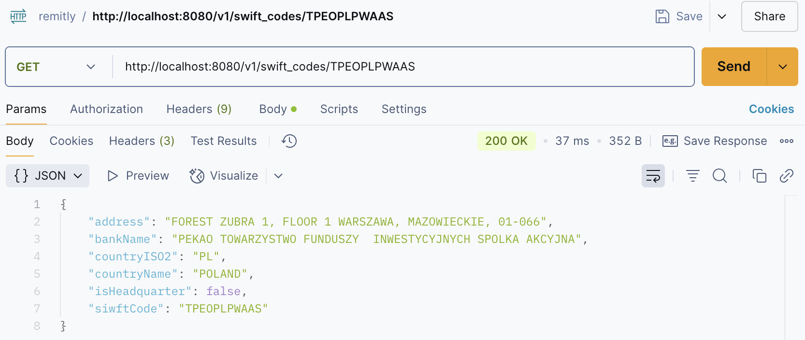
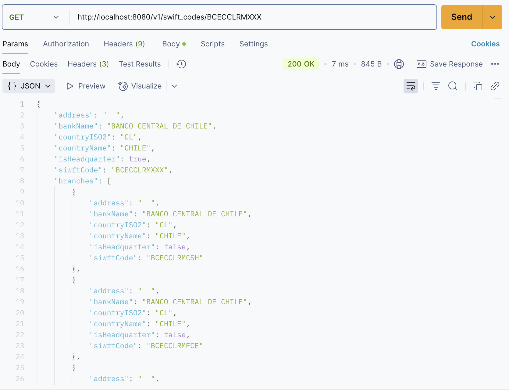
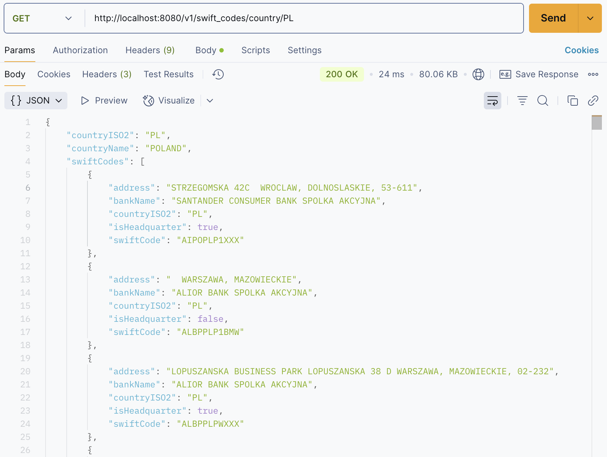
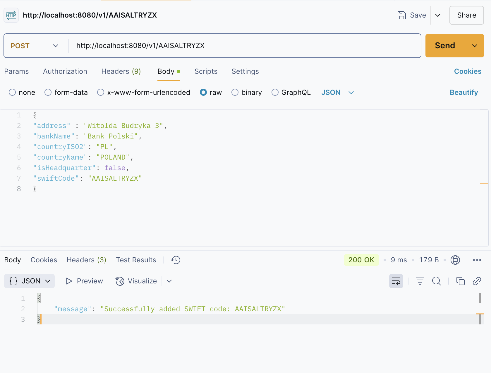
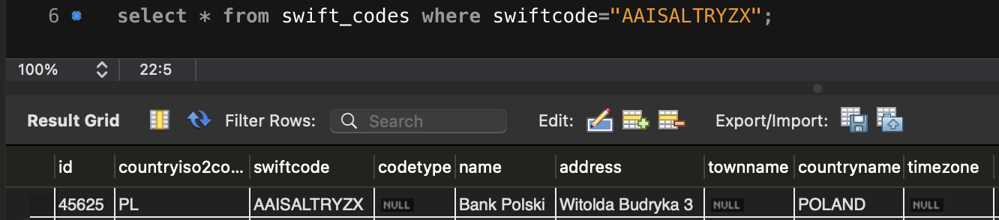
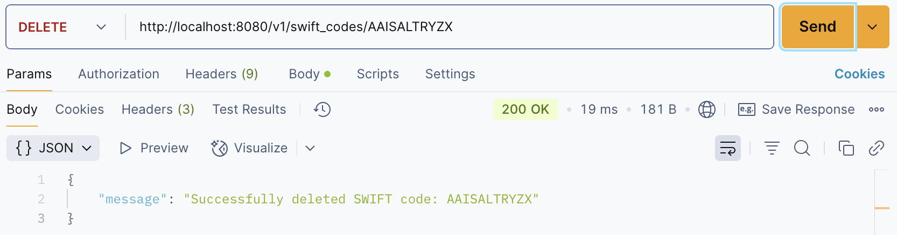
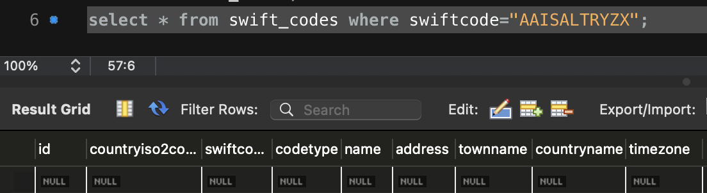

# Remitly_Heesung Kim

## Environment for programming

Database: MYSQL 8.0.35\
Language : go 1.22.5 darwin/amd64\
Endpoint API framework: Postman\
Container : Docker (Docker-compose)

## Fundamental

1. Using docker

- Initiate your wokring directory such as `swiftcode/`
- Please download `$ git clone https://github.com/hscra/remitly_hw.git` in it
- Compose the `yml` file to build the containers. Please run `$ docker compose up --build`. If you port `:3306` already running on your local machine, please turn off for this setup.
- After you completely build it, checks if it is works well by `$ docker ps`

```shell
$ git clone https://github.com/hscra/remitly_hw.git
$ cd swiftcode          # or cd <your module> if you have
$ docker compose up --build
$ docker ps             # check it works correctly
$ docker compose stop   # If you want to stop the container
```

- Quick check to endpoints if docker works corectly by `curl http://localhost:8080/v1/swift_codes/BCECCLRMXXX`

2. Using source code in terminal

- If you want to download all this `https://github.com/hscra/remitly_hw.git` repository, please make your own working directory (ex.swiftcode/). Then, download it into your working directory.
- Step to run the application will be :

```shell
$ git clone https://github.com/hscra/remitly_hw.git
$ cd swiftcode          # or cd <your module> if you have
$ go mod tidy
$ go run main.go        # or whatever entry point file you have
```

- Pleaes check your local mysql database server is running. Please also below **IMPORTANT NOTICE** to set the env for database credential.
- `go run .` useful command to compile and run program, but not build to binary file. For this repository, you can run `go
- `go build` complile the packages if you want.
- After `go build` and run with `./<filename>`

## Parsing

- By using `chan` with given csv file, first openfile will be run to forward parsing stage.
- Call `database.ReadFromCSV(file, chan)` function to streming csv data into a channel.
- `gocsv.UnmarshalToChan(file, c)` will reads from CSV and sends parsed `SwiftcodeData` values into channel `c`

## Set up database

- Implemented `/database` directory

- After parsing successfully, store it into `v1/siwft_codes` database.

- To create the `swift_codes` table, connect to database will be completed by `func ConnectDatabase() (db *sql.DB, err error)`.

**IMPORTANT NOTICE** \
Following command will be required to run this application from your side.

```shell
$ export DBUSER=<your user name>
$ export DBPASS=<your password>
```

- `func CreateSwiftCodesTable(db *sql.DB)` will operating to create table. Next, `func InsertSwiftCodes(db *sql.DB, sc SwiftcodeData)` will be able to insert parsed CSV into designated database table `swift_cdoes`

- The `database/sql` package you’ll be using includes types and functions for connecting to databases , executing transactions, canceling an operation in progress, and more

1. Install driver `go get -u github.com/go-sql-driver/mysql`
2. `Go MySQL Driver` is an implementation of Go's `database/sql/driver`interface. You only need to import the driver and can use the full `database/sql` API then.
3. Set `DBUSER` and `DBPASS` to login your database.
4. `cfg.Addr = "127.0.0.1:3306"` Need to check your port is correct for `3306` of MYSQL.

## RESTful API

- Worked in `handlers/` directory

#### Endpoint 1

- For Endpoint 1 ,`GET: /v1/swift-codes/{swift-code}:` , implemented in `GetDetailsOfSingleSwiftcode` function. The key point is that it should check whether the given swiftcode will be headquarter or branch. By checking it with `strings.Contains(swiftcode, "XXX")`, following logic will be differ. If it is headquarter, the query iterates over database by `rows.Next()`, which will be stored in array of `[]Branches SwiftCodeData ` structure.

- Example
  
  

#### Endpoint 2

- `GET: /v1/swift-codes/country/{countryISO2code}:` , implemented in `func (h *DbHandler) ReturnAllSwiftCodesCountry(c *gin.Context)` function.

- By applying `countryISO2code` parameter with struct `SwiftCodeSummary` that will be utilized to store the reterive data. By set the `countryResponse` structure, it can be better to construct JSON output.

- Example
  

#### Endpoint 3

- `POST: /v1/swift-codes:` to post it , `func (h *DbHandler) AddSwiftCodeToCountry(c *gin.Context)` will help to do it. By applying `c.BindJSON()` it will attach to the user input into JSON format.

- Then, `INSERT INTO swift_cdes VALUES () ` query by using `NewSwiftCode` structure.

- By checking `Rows.Affected()` , it will help to recognize the query works correctly.

- Captured POST example
  
  

#### Endpoint 4

- `DELETE: /v1/swift-codes/{swift-code}` will successfully conducted by `func (h *DbHandler) DeleteSwiftCode(c *gin.Context)`.

- As a parameter , `swiftcode` , will be key to which rows in database will be removed. Of course, `Rows.Affected()` will check the query works that the program intended for.

- Example
  
  

## Testing

- Checked parsing csv correctly `swiftcode/database/db_test.go`
- Checked RESTful api endpoints `swiftcode/handlers/api_test.go`
- By `testing` package , it can run `go test` under the dicretory with command on the terminal
- Ending file name wiht `_test.go` will be configured by GO.

## Miscellaneous

- A `chan` (short for channel) is a communication mechanism that allows goroutines (lightweight threads) to communicate with each other and synchronize their execution.

- By `"fmt"` package [fmt](https://pkg.go.dev/fmt) with placeholder parameters

- `gin.Context` carries request details, validates and serializes JSON. By `*gin.Context.JSON()` will serialize the reterive data.

- [parameters in path of gin](https://gin-gonic.com/en/docs/examples/param-in-path/)

## References

**Parsing** \
[ref1](https://shaileshb.hashnode.dev/go-csv-parsing) - Example for parsing\
[ref2](https://gosamples.dev/read-csv/) - Example of read-csv \
[ref3](https://pkg.go.dev/encoding/csv#section-sourcefiles) - Refer to csv package\
[ref4](https://github.com/gocarina/gocsv/blob/78e41c74b4b1/examples/full/main.go) - Using gocsv module\
[ref5](https://shaileshb.hashnode.dev/go-csv-parsing) - Read csv file into a slice of record structure

**Check Duplicate**\
[ref6](https://stackoverflow.com/questions/39086976/golang-csv-remove-duplicate-if-matching-column-values)

**Database**\
[ref7](https://go.dev/doc/tutorial/database-access) - Introduction to connect MySQL database in GO\
[ref8](https://go.dev/doc/database/) - Accessing relational database\
[ref9](https://golangbot.com/mysql-create-table-insert-row/) - Modularize DB connection and create table

**RESTful API**\
[ref10](https://go.dev/doc/tutorial/web-service-gin) - Introduction RESTful API with GO and Gin
Need to install `go get -u github.com/gin-gonic/gin` to use gin web framework\
[ref11](https://gin-gonic.com/en/docs/quickstart/) - gin\
[ref12](https://go.dev/doc/tutorial/web-service-gin#write-the-code) - Step by step to RESTful API for GO

**Testing**\
[ref13](https://go.dev/doc/tutorial/add-a-test) - Reference to built-in go unit test\
[ref14](https://dev.to/sha254/testing-rest-apis-in-go-a-guide-to-unit-and-integration-testing-with-gos-standard-testing-library-2o9l) - How to invoke test data setup

**Container**\
[ref15](https://docs.docker.com/compose/intro/features-uses/) - Docker compose\
[ref16](https://docs.docker.com/build/concepts/dockerfile/) - Building dockerfile\
[ref17](https://dev.to/goodylili/how-to-deploy-go-applications-with-docker-50n3) - Example of containerzing in golang(from step3a) \
[ref18](https://docs.docker.com/guides/golang/) - Focus on golang docker doc\
[ref19](https://betterstack.com/community/guides/scaling-go/dockerize-golang/#step-5-orchestrating-multiple-containers-with-docker-compose) - Include `.dockerignore` to avoid installl unnecessary files
